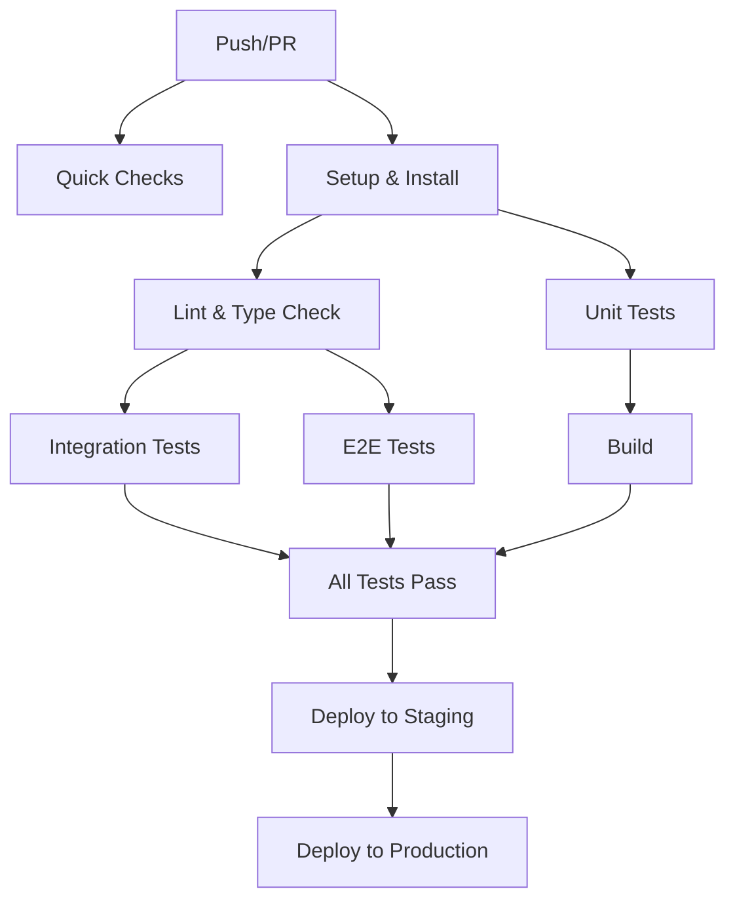

# Required Status Checks Setup

This document explains how to configure GitHub repository settings to ensure all tests must pass before code can be merged.

## Overview

The repository has three main CI/CD workflows that enforce code quality:

1. **`required-checks.yml`** - Main workflow that runs all critical tests
2. **`dashboard-ci.yml`** - Dashboard-specific tests and checks
3. **`ci.yml`** - General CI/CD pipeline with deployment

## Setting Up Required Status Checks

### 1. Navigate to Repository Settings

1. Go to your repository on GitHub
2. Click on **Settings** tab
3. Navigate to **Branches** in the left sidebar

### 2. Configure Branch Protection Rules

#### For `main` branch:

1. Click **Add rule** or edit existing rule for `main`
2. Enable the following settings:

   **✅ Require a pull request before merging**
   - ✅ Require approvals (set to at least 1)
   - ✅ Dismiss stale pull request approvals when new commits are pushed
   - ✅ Require review from CODEOWNERS (if using CODEOWNERS file)

   **✅ Require status checks to pass before merging**
   - ✅ Require branches to be up to date before merging
   
   **Add these required status checks:**
   - `All Required Checks` (from required-checks.yml)
   - `all-tests-pass` (from dashboard-ci.yml)
   - `build` (from ci.yml)
   - `test-unit` (from ci.yml)
   - `test-e2e` (from ci.yml)
   - `security` (from ci.yml)

   **✅ Require conversation resolution before merging**
   
   **✅ Include administrators** (recommended for production)

3. Click **Create** or **Save changes**

#### For `develop` branch:

1. Click **Add rule** for `develop`
2. Enable similar settings but with slightly relaxed requirements:

   **✅ Require a pull request before merging**
   - ✅ Require approvals (can be 1 or 0 for develop)
   
   **✅ Require status checks to pass before merging**
   
   **Add these required status checks:**
   - `All Required Checks` (from required-checks.yml)
   - `lint-and-type-check` (from dashboard-ci.yml)
   - `test-unit` (from ci.yml)

## What Each Check Validates

### Quick Checks (`quick-checks`)
- No merge conflicts in code files
- No debugger statements
- Warns about console.log in production code

### Python Tests (`python-tests`)
- Black formatting compliance
- Ruff linting passes
- All pytest tests pass
- Type hints are valid (MyPy)

### JavaScript Tests (`javascript-tests`)
- TypeScript compilation succeeds
- ESLint rules pass
- Unit tests pass
- No type errors in dashboard

### Dashboard Auth Tests (`dashboard-auth-tests`)
- Authentication endpoints respond correctly
- Session management works
- Login/logout functionality intact
- Social auth endpoints configured

### Build Verification (`build-verification`)
- Next.js applications build successfully
- Docker images build without errors
- No build-time errors

### Security Scan (`security-scan`)
- No critical or high vulnerabilities (Trivy)
- No secrets or credentials in code (TruffleHog)

## CI/CD Workflow Dependencies

The workflows are designed with these dependencies to ensure quality:



## Handling Test Failures

When a test fails:

1. **Check the GitHub Actions tab** to see which specific test failed
2. **Click on the failing job** to see detailed logs
3. **Fix the issue locally** and verify:
   ```bash
   # For TypeScript errors
   pnpm --filter=accesspdf-dashboard run type-check
   
   # For linting errors
   pnpm --filter=accesspdf-dashboard run lint
   
   # For unit test failures
   pnpm --filter=accesspdf-dashboard run test:unit
   
   # For auth test failures
   pnpm --filter=accesspdf-dashboard run test:auth
   ```
4. **Push the fix** and the checks will re-run automatically

## Running Tests Locally Before Push

To avoid CI failures, run these commands before pushing:

```bash
# Run all dashboard tests
cd dashboard
pnpm run type-check
pnpm run lint
pnpm run test:unit
pnpm run test:auth

# Or run everything at once
pnpm run test

# For Python services
source venv/bin/activate
black --check .
ruff check .
pytest services/api/tests/
pytest services/worker/tests/
```

## Bypassing Checks (Emergency Only)

In emergency situations, administrators can bypass checks:

1. **DO NOT** disable "Include administrators" in branch protection
2. Instead, merge directly using admin privileges
3. **Document why** in the merge commit message
4. **Create a follow-up PR** to fix any bypassed issues

## Monitoring CI Performance

- Check the **Actions** tab regularly for trends
- Look for flaky tests that fail intermittently
- Monitor test execution time
- Set up GitHub notifications for failed workflows

## Best Practices

1. **Never merge with failing tests** - they're failing for a reason
2. **Keep tests fast** - slow tests discourage running them
3. **Fix flaky tests immediately** - they erode confidence
4. **Add tests with new features** - maintain coverage
5. **Run tests locally first** - save CI resources

## Troubleshooting

### "Required status check not found"
- The workflow needs to run at least once
- Create a test PR to trigger the workflow
- The status check name must match exactly

### Tests pass locally but fail in CI
- Check environment variables
- Verify database/service versions match
- Look for timing/race conditions
- Check for hardcoded ports or URLs

### Slow CI runs
- Review test parallelization
- Check for unnecessary dependency installs
- Use caching effectively
- Consider splitting large test suites

## Support

For issues with the CI/CD setup:
1. Check the workflow logs in GitHub Actions
2. Review this documentation
3. Check `.github/workflows/*.yml` files
4. Ask in the team chat or create an issue