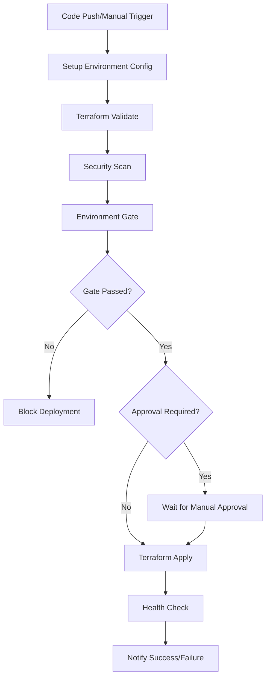
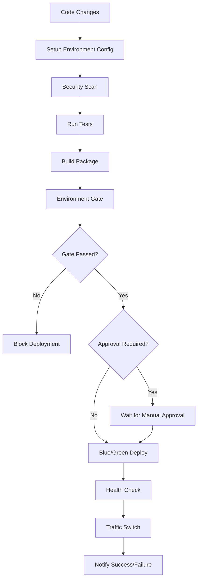

# Environment-Specific Deployment Guide

This guide explains how the environment-specific deployment strategies work in the Make PDF Accessible platform.

## Overview

The platform supports three deployment environments, each with different approval requirements, security thresholds, and deployment strategies:

- **Development (dev)**: Relaxed requirements for rapid iteration
- **Staging (staging)**: Production-like validation with automated testing
- **Production (prod)**: Strict approval gates and security controls

## Environment Configurations

### Development Environment

**Purpose**: Rapid development and testing with minimal friction

**Characteristics**:

- ✅ No manual approval required
- ✅ Relaxed security scanning (allows medium severity issues)
- ✅ Skip time-consuming E2E tests
- ✅ Allow deployment from feature branches
- ✅ Fast deployment with reduced validation
- ✅ Automatic rollback on failure

**Allowed Branches**:

- `main`
- `develop`
- `feature/*`
- `hotfix/*`

**Security Threshold**: Medium (blocks only critical vulnerabilities)

**Deployment Strategy**: Rolling deployment

### Staging Environment

**Purpose**: Production-like testing and validation

**Characteristics**:

- ⏳ Manual approval required for infrastructure changes
- 🔒 Stricter security scanning (blocks high severity issues)
- 🧪 Full test suite including E2E tests
- 🔄 Blue/green deployment strategy
- 📊 Load testing and performance validation
- 🔍 Accessibility testing

**Allowed Branches**:

- `main`
- `release/*`

**Security Threshold**: High (blocks critical and high severity vulnerabilities)

**Deployment Strategy**: Blue/green deployment

### Production Environment

**Purpose**: Live production system with maximum safety

**Characteristics**:

- 🔒 Manual approval required for ALL deployments
- 🛡️ Strictest security scanning (blocks any critical/high severity)
- 👥 Multiple reviewer approval required
- ⏰ Business hours deployment window (09:00-17:00 UTC)
- 🔄 Blue/green deployment with gradual traffic shift
- 📋 Comprehensive testing and validation
- 🚨 Enhanced monitoring and alerting

**Allowed Branches**:

- `main` only
- Git tags matching `v*` pattern

**Security Threshold**: Critical (blocks any critical or high severity vulnerabilities)

**Deployment Strategy**: Blue/green with gradual traffic shifting

## Deployment Workflows

### Infrastructure Deployment



### API Deployment



## Branch Protection Rules

### Main Branch Protection

The `main` branch should be protected with the following rules:

```yaml
# .github/branch-protection/main.yml
protection_rules:
  required_status_checks:
    strict: true
    contexts:
      - 'terraform-validate'
      - 'security-scan'
      - 'test-suite'

  enforce_admins: true

  required_pull_request_reviews:
    required_approving_review_count: 2
    dismiss_stale_reviews: true
    require_code_owner_reviews: true

  restrictions:
    users: []
    teams:
      - 'platform-team'
      - 'security-team'
```

### Environment-Specific Branch Rules

#### Development

- Allow direct pushes to `develop` branch
- Require PR for `main` branch merges
- No deployment restrictions

#### Staging

- Require PR reviews for `release/*` branches
- Require status checks to pass
- Allow deployment only from `main` and `release/*`

#### Production

- Require multiple PR reviews
- Require all status checks to pass
- Allow deployment only from `main` branch
- Require signed commits

## Security Thresholds

### Vulnerability Severity Mapping

| Severity | Development | Staging  | Production |
| -------- | ----------- | -------- | ---------- |
| Critical | ⚠️ Warn     | ❌ Block | ❌ Block   |
| High     | ✅ Allow    | ❌ Block | ❌ Block   |
| Medium   | ✅ Allow    | ⚠️ Warn  | ❌ Block   |
| Low      | ✅ Allow    | ✅ Allow | ⚠️ Warn    |

### Security Scan Types

1. **Dependency Scanning**
   - npm audit (Web)
   - Safety/pip-audit (Python)
   - Trivy (Containers)

2. **Static Analysis**
   - ESLint security rules
   - Bandit (Python SAST)
   - CodeQL (if enabled)

3. **Container Security**
   - Base image vulnerabilities
   - Runtime security policies
   - Image signing verification

## Approval Workflows

### Development Environment

- **Approval Required**: No
- **Auto-deployment**: Yes
- **Reviewers**: None required

### Staging Environment

- **Approval Required**: Infrastructure changes only
- **Auto-deployment**: Application changes only
- **Reviewers**: 1 from platform team

### Production Environment

- **Approval Required**: All deployments
- **Auto-deployment**: Never
- **Reviewers**: 2 from platform team + 1 from security team
- **Approval Timeout**: 24 hours

## Deployment Windows

### Development

- **Available**: 24/7
- **Restrictions**: None

### Staging

- **Available**: Business hours preferred
- **Restrictions**: Avoid Friday afternoons

### Production

- **Available**: Business hours only (09:00-17:00 UTC)
- **Emergency Window**: 02:00-04:00 UTC (with additional approval)
- **Blackout Periods**: Major holidays, known high-traffic events

## Emergency Deployments

### Emergency Override Process

1. **Trigger**: Set `emergency_deployment: true` in workflow dispatch
2. **Effect**:
   - Bypasses approval for dev/staging
   - Reduces validation time
   - Still requires approval for production
3. **Notification**: High-priority alerts sent to on-call team
4. **Documentation**: Requires post-deployment incident report

### Emergency Contacts

- **Platform Team**: @platform-oncall
- **Security Team**: @security-oncall
- **Management Escalation**: @engineering-leadership

## Monitoring and Alerting

### Deployment Notifications

#### Development

- **Success**: No notification
- **Failure**: Slack #dev-deployments

#### Staging

- **Success**: Slack #staging-deployments
- **Failure**: Slack #staging-deployments + Email
- **Approval Required**: Slack #platform-team

#### Production

- **Success**: Slack #prod-alerts + Email + Dashboard
- **Failure**: Slack #prod-alerts + Email + PagerDuty
- **Approval Required**: Slack #platform-team + Email
- **Security Events**: High-priority PagerDuty alert

### Metrics and Dashboards

- **Deployment Frequency**: Track deployments per environment
- **Lead Time**: Time from commit to production
- **Failure Rate**: Percentage of failed deployments
- **Recovery Time**: Time to recover from failures

## Configuration Management

### Environment Variables

Each environment uses different configuration values:

```bash
# Development
ENVIRONMENT=dev
AWS_RESOURCE_PREFIX=pdf-accessibility-dev
LOG_LEVEL=DEBUG
RATE_LIMITING=disabled

# Staging
ENVIRONMENT=staging
AWS_RESOURCE_PREFIX=pdf-accessibility-staging
LOG_LEVEL=INFO
RATE_LIMITING=relaxed

# Production
ENVIRONMENT=prod
AWS_RESOURCE_PREFIX=pdf-accessibility-prod
LOG_LEVEL=WARN
RATE_LIMITING=strict
```

### Secrets Management

- **Development**: Shared development secrets
- **Staging**: Production-like secrets (non-sensitive)
- **Production**: Encrypted production secrets with rotation

## Troubleshooting

### Common Issues

#### Deployment Blocked by Security Gate

```bash
# Check security scan results
gh run view <run-id> --log

# Review vulnerability details
cat security-scan-results.json | jq '.vulnerabilities[]'

# Fix vulnerabilities and retry
```

#### Approval Timeout

```bash
# Check approval status
gh run view <run-id>

# Request approval from team
gh pr review <pr-number> --approve

# Or cancel and retry
gh run cancel <run-id>
```

#### Branch Not Allowed

```bash
# Check environment configuration
cat .github/environments/<env>.yml

# Switch to allowed branch
git checkout main
git merge <feature-branch>
```

### Support Channels

- **General Questions**: #platform-support
- **Security Issues**: #security-team
- **Emergency**: @platform-oncall

## Best Practices

### Development

1. Test changes in development first
2. Use feature branches for experimental work
3. Keep deployments small and frequent
4. Monitor logs after deployment

### Staging

1. Deploy to staging before production
2. Run full test suite
3. Validate performance under load
4. Test rollback procedures

### Production

1. Deploy during business hours when possible
2. Have rollback plan ready
3. Monitor metrics closely
4. Communicate with stakeholders
5. Document any issues or learnings

### Security

1. Keep dependencies updated
2. Review security scan results
3. Follow principle of least privilege
4. Rotate secrets regularly
5. Monitor for security events
