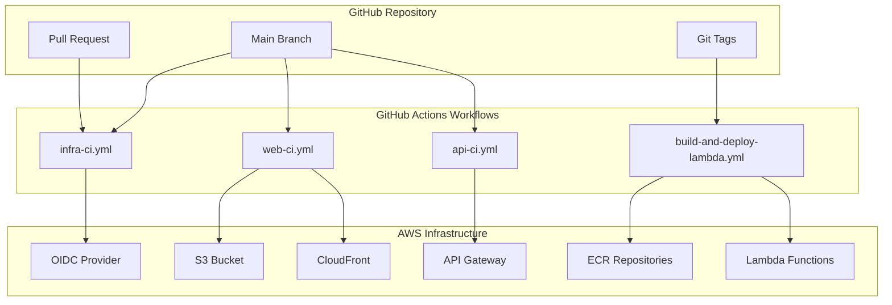

# GitHub Actions CI/CD Documentation

This directory contains comprehensive documentation and configuration for secure GitHub Actions CI/CD workflows with AWS OIDC integration.

## 📋 Quick Start

1. **Setup OIDC Integration**

   ```bash
   # Run the automated setup script
   ./setup-oidc.sh --github-org your-org --github-repo your-repo --aws-account-id 123456789012
   ```

2. **Configure Secrets**
   - Follow the [Secrets Configuration Guide](SECRETS.md)
   - Use environment-specific templates from `templates/`

3. **Test Setup**
   ```bash
   # Run the test workflow
   gh workflow run test-oidc.yml
   ```

## 📚 Documentation

### Core Documentation

| Document                                              | Purpose                                 |
| ----------------------------------------------------- | --------------------------------------- |
| [IAM Setup Guide](IAM_SETUP.md)                       | Complete IAM configuration for OIDC     |
| [Secrets Configuration](SECRETS.md)                   | GitHub Secrets setup and management     |
| [Security Best Practices](SECURITY_BEST_PRACTICES.md) | Security guidelines and recommendations |
| [Troubleshooting Guide](TROUBLESHOOTING.md)           | Common issues and solutions             |

### Configuration Templates

| Template                                                       | Environment | Purpose                              |
| -------------------------------------------------------------- | ----------- | ------------------------------------ |
| [development.env.template](templates/development.env.template) | Development | Dev environment configuration        |
| [staging.env.template](templates/staging.env.template)         | Staging     | Staging environment configuration    |
| [production.env.template](templates/production.env.template)   | Production  | Production environment configuration |

### IAM Policies

| Policy                                                                  | Purpose                             |
| ----------------------------------------------------------------------- | ----------------------------------- |
| [infrastructure-policy.json](policies/infrastructure-policy.json)       | Terraform infrastructure deployment |
| [lambda-deployment-policy.json](policies/lambda-deployment-policy.json) | Lambda function deployment          |
| [web-deployment-policy.json](policies/web-deployment-policy.json)       | Web application deployment          |
| [api-deployment-policy.json](policies/api-deployment-policy.json)       | API deployment with blue/green      |

## 🔧 Setup Scripts

### Automated Setup

```bash
# Full setup with custom configuration
./setup-oidc.sh \
  --github-org your-organization \
  --github-repo your-repository \
  --aws-account-id 123456789012 \
  --aws-region us-east-1
```

### Manual Setup

If you prefer manual setup, follow these guides in order:

1. [IAM Setup Guide](IAM_SETUP.md) - Create OIDC provider and IAM roles
2. [Secrets Configuration](SECRETS.md) - Configure GitHub Secrets
3. [Security Best Practices](SECURITY_BEST_PRACTICES.md) - Apply security configurations

## 🏗️ Workflow Architecture



## 🔐 Security Features

- **OIDC Authentication**: No long-lived AWS credentials stored
- **Least Privilege IAM**: Minimal permissions for each workflow
- **Branch Protection**: Restrict deployments to specific branches
- **Environment Gates**: Manual approval for production deployments
- **Vulnerability Scanning**: Container and dependency scanning
- **Audit Logging**: Comprehensive deployment logging

## 🚀 Workflows

### Infrastructure CI (`infra-ci.yml`)

- Terraform validation and planning
- Manual approval for production changes
- State management with S3 backend

### Lambda Build & Deploy (`build-and-deploy-lambda.yml`)

- Multi-service container builds
- Semantic versioning with git tags
- ECR image management
- Health check validation

### Web CI (`web-ci.yml`)

- Next.js production builds
- S3 static asset deployment
- CloudFront cache invalidation
- Build artifact management

### API CI (`api-ci.yml`)

- Comprehensive testing (unit + integration)
- Blue/green deployment strategy
- Automatic rollback on failures
- Health check validation

## 📊 Monitoring & Notifications

### Supported Notification Channels

- Slack
- Microsoft Teams
- Discord
- Email (via AWS SES)

### Monitoring Integration

- DataDog
- New Relic
- CloudWatch
- Custom metrics

## 🛠️ Environment Configuration

### Development Environment

- Relaxed approval requirements
- Debug logging enabled
- Branch deployments allowed
- Automatic deployment on push

### Staging Environment

- Manual approval required
- Load testing enabled
- Blue/green deployment
- Integration tests required

### Production Environment

- Strict approval gates
- Enhanced security scanning
- Automated backups
- Compliance reporting

## 📋 Prerequisites

### Required Tools

- AWS CLI (v2.0+)
- GitHub CLI (v2.0+)
- Terraform (v1.0+)
- Docker (v20.0+)

### AWS Permissions

- IAM role creation and management
- OIDC provider management
- Service-specific permissions (Lambda, S3, etc.)

### GitHub Permissions

- Repository admin access
- Secrets management
- Actions workflow management

## 🔍 Validation & Testing

### Pre-deployment Validation

```bash
# Validate Terraform configuration
terraform validate

# Check IAM policies
aws iam simulate-principal-policy \
  --policy-source-arn arn:aws:iam::ACCOUNT:role/GitHubActions-Infrastructure \
  --action-names ec2:CreateVpc \
  --resource-arns "*"

# Test GitHub secrets
gh secret list
```

### Post-deployment Testing

```bash
# Test OIDC authentication
gh workflow run test-oidc.yml

# Validate deployments
curl -f https://api.yourdomain.com/health
```

## 🆘 Support & Troubleshooting

### Common Issues

1. **OIDC Authentication Failures** - See [Troubleshooting Guide](TROUBLESHOOTING.md#oidc-authentication-issues)
2. **Permission Denied Errors** - Check IAM policies and trust relationships
3. **Terraform State Issues** - Verify S3 backend configuration
4. **Container Build Failures** - Check Dockerfile and dependencies

### Getting Help

1. Check the [Troubleshooting Guide](TROUBLESHOOTING.md)
2. Review workflow logs in GitHub Actions
3. Validate configuration with provided scripts
4. Contact the DevOps team for assistance

### Debug Mode

Enable debug logging by setting repository variables:

```bash
gh variable set ACTIONS_STEP_DEBUG --body "true"
gh variable set ACTIONS_RUNNER_DEBUG --body "true"
```

## 📝 Contributing

### Adding New Workflows

1. Follow the established patterns in existing workflows
2. Use OIDC authentication for AWS access
3. Implement proper error handling and notifications
4. Add comprehensive testing and validation
5. Update documentation

### Updating IAM Policies

1. Follow least privilege principles
2. Test changes in development environment first
3. Update policy files in `policies/` directory
4. Document changes in commit messages

### Security Considerations

1. Never store long-lived credentials
2. Use environment-specific secrets
3. Implement proper approval gates
4. Enable audit logging
5. Regular security reviews

## 📈 Metrics & KPIs

### Deployment Metrics

- Deployment frequency
- Lead time for changes
- Mean time to recovery
- Change failure rate

### Security Metrics

- Failed authentication attempts
- Policy violations
- Vulnerability scan results
- Incident response times

### Performance Metrics

- Build times
- Test execution times
- Deployment duration
- Resource utilization

## 🔄 Maintenance

### Regular Tasks

- [ ] Review and rotate secrets monthly
- [ ] Update IAM policies quarterly
- [ ] Audit workflow permissions
- [ ] Update container base images
- [ ] Review security scan results

### Automated Maintenance

- Secret rotation workflows
- Dependency updates
- Security scanning
- Performance monitoring
- Compliance reporting

## 📚 Additional Resources

- [AWS OIDC Documentation](https://docs.aws.amazon.com/IAM/latest/UserGuide/id_roles_providers_create_oidc.html)
- [GitHub Actions Security](https://docs.github.com/en/actions/security-guides)
- [Terraform Best Practices](https://www.terraform.io/docs/cloud/guides/recommended-practices/index.html)
- [Container Security](https://docs.docker.com/engine/security/)

---

**Last Updated**: $(date)
**Version**: 1.0.0
**Maintainer**: DevOps Team
