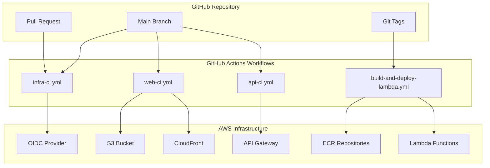
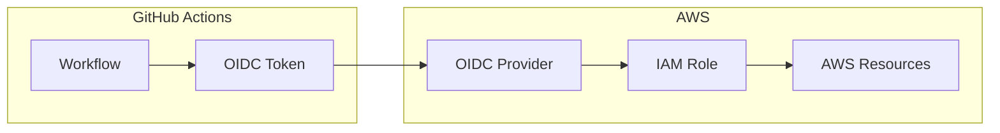
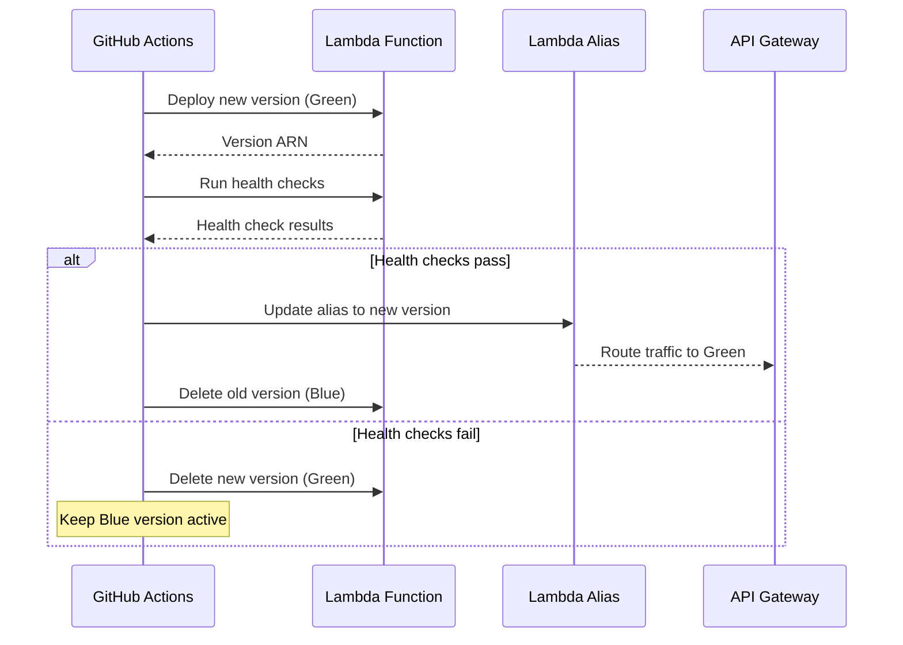

# Design Document

## Overview

This design implements a comprehensive CI/CD pipeline using GitHub Actions workflows for the Make PDF Accessible platform. The solution provides secure, automated deployment of infrastructure, Lambda functions, web applications, and APIs using modern DevOps practices including OIDC authentication, blue/green deployments, and comprehensive testing.

## Architecture

### Workflow Architecture



### Security Architecture



## Components and Interfaces

### 1. Infrastructure CI Workflow (infra-ci.yml)

**Purpose**: Manages Terraform infrastructure deployment with validation and approval gates.

**Triggers**:

- Pull requests affecting `infra/terraform/**`
- Pushes to main branch with infrastructure changes
- Manual workflow dispatch

**Key Components**:

- Terraform format validation
- Terraform plan generation and PR comments
- Manual approval gate for production deployments
- OIDC role assumption for AWS access
- State file management with S3 backend

**Outputs**:

- Terraform plan summaries in PR comments
- Infrastructure deployment status
- Resource change notifications

### 2. Lambda Build and Deploy Workflow (build-and-deploy-lambda.yml)

**Purpose**: Builds and deploys Lambda function container images with semantic versioning.

**Triggers**:

- Changes to `services/functions/**` or `services/api/**` or `services/worker/**`
- Git tag creation (for production releases)
- Manual workflow dispatch

**Key Components**:

- Multi-service Docker image building
- Semantic version tagging based on git tags
- ECR image pushing with vulnerability scanning
- Lambda function configuration updates
- Health check validation

**Outputs**:

- Container image URIs
- Lambda function deployment status
- Health check results

### 3. Web Application CI Workflow (web-ci.yml)

**Purpose**: Builds and deploys Next.js application to S3 with CloudFront invalidation.

**Triggers**:

- Changes to `web/**`
- Pushes to main branch
- Manual workflow dispatch

**Key Components**:

- Next.js production build
- Static asset optimization
- S3 deployment with versioning
- CloudFront cache invalidation
- Build artifact management

**Outputs**:

- Build artifacts
- Deployment URLs
- Cache invalidation status

### 4. API CI Workflow (api-ci.yml)

**Purpose**: Tests and deploys API services using blue/green deployment strategy.

**Triggers**:

- Changes to `services/api/**`
- Pushes to main branch
- Manual workflow dispatch

**Key Components**:

- Comprehensive test suite execution
- Lambda package creation
- Blue/green deployment via aliases
- Health check validation
- Automatic rollback on failure

**Outputs**:

- Test results and coverage
- Deployment status
- Health check results

## Data Models

### Workflow Configuration Schema

```yaml
# Common workflow inputs
inputs:
  environment:
    description: 'Deployment environment'
    required: true
    type: choice
    options: ['dev', 'staging', 'prod']

  dry_run:
    description: 'Perform dry run without actual deployment'
    required: false
    type: boolean
    default: false

# Common outputs
outputs:
  deployment_status:
    description: 'Status of the deployment'
    value: ${{ steps.deploy.outputs.status }}

  deployment_url:
    description: 'URL of the deployed application'
    value: ${{ steps.deploy.outputs.url }}
```

### IAM Role Trust Policy Schema

```json
{
  "Version": "2012-10-17",
  "Statement": [
    {
      "Effect": "Allow",
      "Principal": {
        "Federated": "arn:aws:iam::ACCOUNT_ID:oidc-provider/token.actions.githubusercontent.com"
      },
      "Action": "sts:AssumeRoleWithWebIdentity",
      "Condition": {
        "StringEquals": {
          "token.actions.githubusercontent.com:aud": "sts.amazonaws.com"
        },
        "StringLike": {
          "token.actions.githubusercontent.com:sub": "repo:OWNER/REPO:ref:refs/heads/BRANCH"
        }
      }
    }
  ]
}
```

### Deployment Metadata Schema

```json
{
  "deployment": {
    "id": "string",
    "timestamp": "ISO8601",
    "environment": "dev|staging|prod",
    "version": "semver",
    "commit_sha": "string",
    "services": [
      {
        "name": "string",
        "type": "lambda|web|api",
        "status": "success|failed|pending",
        "url": "string",
        "health_check": "boolean"
      }
    ]
  }
}
```

## Error Handling

### Terraform Deployment Errors

- **Plan Failures**: Validate syntax and provider configurations before plan
- **Apply Failures**: Implement automatic rollback using Terraform state
- **State Lock Issues**: Implement retry logic with exponential backoff
- **Resource Conflicts**: Provide clear error messages and resolution steps

### Lambda Deployment Errors

- **Build Failures**: Capture and display detailed build logs
- **Image Push Failures**: Retry with exponential backoff, check ECR permissions
- **Function Update Failures**: Rollback to previous version automatically
- **Health Check Failures**: Trigger automatic rollback and alert administrators

### Web Deployment Errors

- **Build Failures**: Display detailed webpack/Next.js error logs
- **S3 Upload Failures**: Implement retry logic and verify permissions
- **CloudFront Invalidation Failures**: Continue deployment but alert administrators
- **Asset Optimization Failures**: Fallback to unoptimized assets with warnings

### API Deployment Errors

- **Test Failures**: Block deployment and provide detailed test reports
- **Blue/Green Switch Failures**: Maintain traffic on stable version
- **Health Check Failures**: Automatic rollback with detailed error reporting
- **Database Migration Failures**: Rollback migrations and alert administrators

## Testing Strategy

### Infrastructure Testing

```yaml
# Terraform validation pipeline
- name: Terraform Format Check
  run: terraform fmt -check -recursive

- name: Terraform Validate
  run: terraform validate

- name: Terraform Security Scan
  uses: aquasecurity/trivy-action@master
  with:
    scan-type: 'config'
    scan-ref: 'infra/terraform'
```

### Lambda Function Testing

```yaml
# Multi-service testing pipeline
- name: Unit Tests
  run: |
    for service in api worker router ocr structure tagger exporter validator notifier; do
      echo "Testing $service..."
      docker-compose run --rm function-$service pytest tests/ -v --cov
    done

- name: Integration Tests
  run: |
    docker-compose up -d postgres redis
    docker-compose run --rm api pytest tests/integration/ -v
```

### Web Application Testing

```yaml
# Frontend testing pipeline
- name: Unit Tests
  run: |
    cd web
    npm test -- --coverage --watchAll=false

- name: Build Test
  run: |
    cd web
    npm run build

- name: E2E Tests
  uses: cypress-io/github-action@v5
  with:
    working-directory: web
    start: npm start
    wait-on: 'http://localhost:3000'
```

### API Testing

```yaml
# API testing pipeline
- name: Unit Tests
  run: |
    cd services/api
    pytest tests/unit/ -v --cov

- name: Integration Tests
  run: |
    docker-compose up -d postgres redis
    cd services/api
    pytest tests/integration/ -v

- name: Load Tests
  run: |
    cd services/api
    locust --headless --users 100 --spawn-rate 10 --run-time 60s --host http://localhost:8000
```

## Security Considerations

### OIDC Configuration

- **Trust Policies**: Restrict access to specific repositories and branches
- **Token Validation**: Verify audience and subject claims
- **Role Permissions**: Implement least-privilege access for each workflow
- **Session Duration**: Limit role session duration to minimum required

### Secrets Management

- **GitHub Secrets**: Store sensitive configuration values
- **AWS Parameter Store**: Store runtime configuration
- **Environment Separation**: Separate secrets per environment
- **Rotation Policy**: Implement regular secret rotation

### Container Security

- **Base Image Scanning**: Scan all base images for vulnerabilities
- **Dependency Scanning**: Check for known vulnerabilities in dependencies
- **Runtime Security**: Implement container runtime security policies
- **Image Signing**: Sign container images for integrity verification

## Deployment Strategy

### Blue/Green Deployment Flow



### Rollback Strategy

- **Automatic Rollback**: Triggered by health check failures
- **Manual Rollback**: Available via workflow dispatch
- **Database Rollback**: Coordinated with application rollback
- **Cache Invalidation**: Clear caches during rollback

## Monitoring and Alerting

### Deployment Monitoring

- **CloudWatch Metrics**: Track deployment success/failure rates
- **Custom Metrics**: Monitor deployment duration and frequency
- **Log Aggregation**: Centralize logs from all deployment stages
- **Performance Monitoring**: Track application performance post-deployment

### Alert Configuration

- **Deployment Failures**: Immediate alerts to DevOps team
- **Health Check Failures**: Escalating alerts with automatic rollback
- **Security Events**: High-priority alerts to security team
- **Performance Degradation**: Alerts when metrics exceed thresholds

## Configuration Management

### Environment Variables

```yaml
# Production environment
ENVIRONMENT: prod
AWS_REGION: us-east-1
ECR_REGISTRY: 123456789012.dkr.ecr.us-east-1.amazonaws.com
S3_BUCKET: pdf-accessibility-prod-web
CLOUDFRONT_DISTRIBUTION_ID: E1234567890123

# Development environment
ENVIRONMENT: dev
AWS_REGION: us-east-1
ECR_REGISTRY: 123456789012.dkr.ecr.us-east-1.amazonaws.com
S3_BUCKET: pdf-accessibility-dev-web
CLOUDFRONT_DISTRIBUTION_ID: E0987654321098
```

### Workflow Secrets

```yaml
# Required GitHub Secrets
AWS_ACCOUNT_ID: '123456789012'
AWS_REGION: 'us-east-1'
TERRAFORM_BACKEND_BUCKET: 'pdf-accessibility-terraform-state'
SLACK_WEBHOOK_URL: 'https://hooks.slack.com/...'
DATADOG_API_KEY: '...'
```
